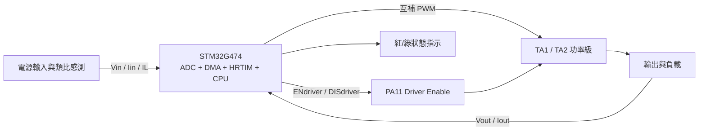
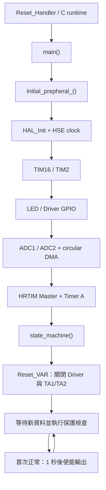
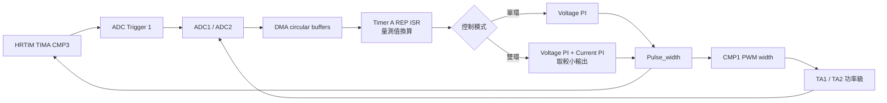

# STM32G474_BUCK 架構

本文件是倉庫根目錄的架構入口。完整 UML、狀態機與控制時序見 [docs/UML.md](docs/UML.md)，完整函式呼叫與硬體事件圖見 [docs/CALL_GRAPH.md](docs/CALL_GRAPH.md)。

## 系統概觀

此倉庫以 6 套獨立 STM32G474 Keil 工程展示數位電源控制。六套工程共享相同的應用骨架，但依控制模式與輸出目標保留不同參數：

| 分組 | 例程 | 控制 | 開關頻率 | 目標 |
|---|---|---|---:|---|
| 電壓單環 | 1、2、3 | `PID_loop(Vout)` | 800 kHz | 5/12/16 V |
| 恆壓恆流 | 4、5、6 | `PID_loop(Vout, Iout)` | 200 kHz | 5/12/16 V、3 A |

目前沒有 RTOS。系統由前台無限狀態機與 HRTIM Timer A 高優先級中斷共同運作。

## 系統上下文

## 軟體分層

| 層級 | 主要檔案 | 責任 |
|---|---|---|
| 入口與例外 | `User_code/main.c`, `stm32g4xx_it.c` | 進入初始化/狀態機，處理 SysTick 與 CPU 例外 |
| 系統初始化 | `mycode/Int.c`, `clock_config.c`, `Delay.c` | HAL、170 MHz 時鐘、TIM16/TIM2 與外設初始化排序 |
| 板級 IO | `mycode/RGB.c/.h`, `Config.h` | LED、PA11 驅動使能及腳位說明 |
| 取樣 | `mycode/ADC.c/.h` | ADC1/2 掃描、校正、循環 DMA |
| PWM/觸發 | `mycode/HRTIM.c/.h` | Timer A PWM、死區、CMP3 ADC 觸發、REP IRQ |
| 即時控制 | `mycode/PID.c/.h` | 增量 PI、單/雙環選擇、CMP1/CMP3 更新 |
| 監督控制 | `mycode/state_machine.c/.h` | 啟動、軟啟動、量測換算、OVP/UVP/OCP 與輸出門控 |
| 平台 | `HAL_lib/`, `MDK/` | STM32 HAL/LL、CMSIS、啟動與建置設定 |

`HRTIM1_TIMA_IRQHandler()` 目前也位於 `state_machine.c`，因此即時控制與監督狀態仍耦合在同一模組。

## 啟動流程

ADC/DMA 在 HRTIM 前初始化，使資料路徑先就緒。HRTIM 啟動後提供 ADC 觸發與 REP IRQ；狀態機進入初始狀態後再次明確關閉驅動和 PWM 輸出。

## 即時控制迴路

PI 採增量形式。雙環示例分別計算 `V_PI` 與 `I_PI`，以較小輸出限制脈寬；`CMP3 = Pulse_width >> 1` 讓 ADC 觸發點跟隨脈寬中點。

## 前台監督與保護

前台狀態機依序執行：

1. 初始/故障復位：清控制狀態、關閉 PA11 與 TA1/TA2、初始化 PI、顯示紅燈。
2. 等待 `Data_update_flag`，檢查輸入 24 V OVP、8 V UVP 及各 2 V 恢復滯回。
3. 檢查輸出 OVP，越限計數超過 200 時復位。
4. 檢查 3.6 A OCP，越限計數超過 2000 時復位。
5. 首次正常時等待 1 秒、顯示綠燈、使能 Driver 與 TA1/TA2。
6. 後續持續回到輸入檢查。

這些保護目前屬於前台軟體路徑；HRTIM `FaultEnable` 設為 `NONE`，不可把它視為逐周期硬體保護。

## 重要不變條件

- 輸出未通過啟動條件或遇到故障時，PA11 驅動使能與 HRTIM TA1/TA2 都必須關閉。
- ADC/DMA 緩衝區元素順序和工程量換算必須同步變更。
- `CMP1` 與 `CMP3` 必須保持合法範圍，且 CMP3 的取樣點不能落在無效或高雜訊區域。
- 單環與雙環的 `PID_loop` 介面不同，不能直接跨分組複製。
- 改變 PWM/REP 會同時改變控制更新率、軟啟動斜率及保護計數對應時間。
- 任何保護門檻或 PI 參數調整都需要明確版本、建置與板測紀錄。

## 已知架構債務

- ISR/前台共享資料缺乏明確同步策略。
- `ADC2_RESULT` 定義/宣告尺寸不一致。
- OCP 在單環與雙環例程中分別採累計/連續越限語意。
- 忙等待軟啟動暫停前台保護。
- ADC 外部觸發與連續轉換同時啟用，取樣同步性待確認。
- `common.h` 循環 include 與六份程式副本提高修改漂移風險。

## 維護文件導覽

- [PLAN.md](PLAN.md)：分階段改善方向。
- [PROGRESS.md](PROGRESS.md)：目前完成度與驗證限制。
- [TASKS.md](TASKS.md)：可執行任務與優先級。
- [DECISIONS.md](DECISIONS.md)：已接受及待決策事項。
- [MEMORY.md](MEMORY.md)：跨工作階段的重要事實與陷阱。
- [CHANGELOG.md](CHANGELOG.md)：使用者可見的變更紀錄。
- [AGENTS.md](AGENTS.md)：後續維護與自動化代理規則。
