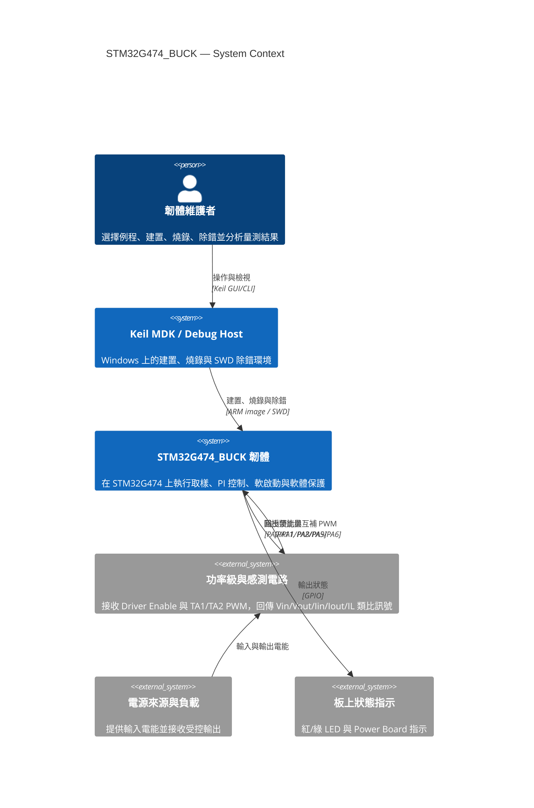
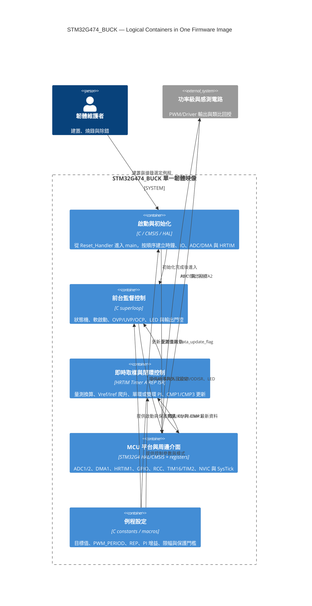
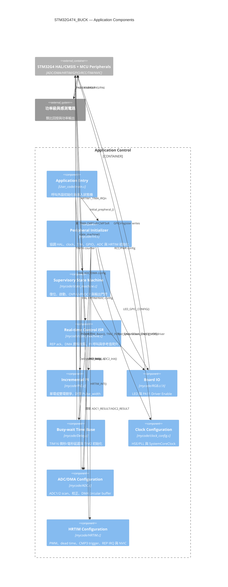
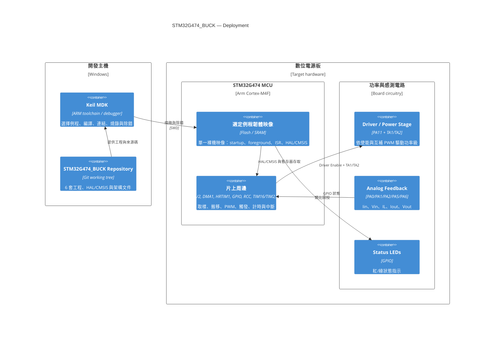

# STM32G474_BUCK C4 架構模型

本文以 C4 Model 從系統上下文、容器、元件與部署四個層級描述 STM32G474_BUCK。狀態機與控制時序見 [UML.md](UML.md)，函式級呼叫關係見 [CALL_GRAPH.md](CALL_GRAPH.md)，穩定架構摘要見 [../ARCHITECTURE.md](../ARCHITECTURE.md)。

## 1. 使用方式與邊界

這是一個無 RTOS、單一 MCU 映像的裸機系統。標準 C4 的 Container 通常表示可獨立部署或執行的單元；本文為了表達韌體內部的執行責任，將 Container 當成**單一映像內的邏輯執行邊界**，不表示它們是獨立程序、RTOS task 或可分開燒錄的映像。

| C4 層級 | 本專案的問題 | 主要讀者 |
|---|---|---|
| Level 1：System Context | 韌體與誰/什麼互動？ | 專案負責人、硬體/韌體工程師 |
| Level 2：Container | 單一映像內有哪些執行責任？ | 韌體架構與整合工程師 |
| Level 3：Component | 責任如何映射到 C 模組與函式？ | 實作者、審查者 |
| Deployment | 映像部署在哪裡，經由哪些硬體邊界互動？ | 建置、除錯與板級驗證人員 |

圖中的「功率級與感測電路」依現有腳位、ADC 與 PWM 程式行為建模；本文不推導或保證功率拓撲能力。六套例程仍是六個獨立 Keil 工程與映像。

## 2. Level 1：System Context



### 系統責任

STM32G474_BUCK 韌體負責：

- 初始化 170 MHz 系統時鐘、TIM16/TIM2、GPIO、ADC1/2、DMA 與 HRTIM。
- 透過 ADC/DMA 取得五個回授量，並在 HRTIM REP ISR 中轉換成工程值。
- 執行電壓單環或電壓/輸出電流雙 PI，更新 HRTIM CMP1/CMP3。
- 以前台狀態機執行啟動、指示、輸入 OVP/UVP、輸出 OVP/OCP 及雙重輸出門控。

工具鏈負責建置與部署，不參與板上即時控制。功率級、感測器與 LED 都是韌體外部系統；STM32 片上周邊則在 Level 2 視為平台容器。

## 3. Level 2：Container



### Container 說明

| 邏輯 Container | 執行上下文 | 生命週期 | 主要資料所有權 |
|---|---|---|---|
| 啟動與初始化 | Reset/main 前台 | 上電一次 | 外設 handle 與初始組態 |
| 前台監督控制 | `state_machine()` 無限迴圈 | 韌體全生命週期 | 狀態、保護計數、輸出門控 |
| 即時取樣與閉環控制 | `HRTIM1_TIMA_IRQHandler()` | 每次 Timer A REP 事件 | 工程量、PI 狀態、參考值、CMP1/CMP3 |
| MCU 平台與周邊介面 | 硬體、HAL/CMSIS、NVIC | 上電後持續 | DMA buffer、暫存器、tick |
| 例程設定 | 編譯期 | 每個例程固定 | 目標、門檻、頻率、增益與限幅 |

前台與 ISR 透過共享全域變數直接通訊，沒有訊息佇列或 RTOS primitive。`Data_update_flag` 是單槽通知，可能合併多次中斷；這是現況描述，不代表推薦的同步模型。

## 4. Level 3：Component



### 元件到程式碼的主要映射

| 元件 | 入口 | 主要輸出/副作用 |
|---|---|---|
| Application Entry | `main()` | 初始化完成後永久進入狀態機 |
| Peripheral Initializer | `Initial_prepheral_()` | 建立所有活動周邊與中斷 |
| Supervisory State Machine | `state_machine()`, `Reset_VAR()` | `Current_State/Next_State`、Driver/HRTIM 輸出門控 |
| Real-time Control ISR | `HRTIM1_TIMA_IRQHandler()` | `Vin/Vout/Iin/Iout/IL_average`、`Data_update_flag`、PI 呼叫 |
| Incremental PI | `PID_INT()`, `PID_loop()` | `Pulse_width`、HRTIM CMP1/CMP3 |
| ADC/DMA Configuration | `ADC1_Init()`, `ADC2_Init()` | `ADC1_RESULT[3]`, `ADC2_RESULT[2]` |
| HRTIM Configuration | `HRTIM_INT()` | TA1/TA2、ADC Trigger 1、REP IRQ |
| Board IO | `LED_GPIO_CONFIG()`, `Red_ON()`, `Green_ON()` | LED GPIO 與 PA11 |

`HRTIM1_TIMA_IRQHandler()` 與前台狀態機目前同檔，圖中仍把它們拆成兩個元件，因為它們有不同執行上下文、時序約束及修改風險。

## 5. Deployment View



每次只部署其中一個例程的映像。圖中的 Keil 工具鏈版本、確切 target 與映像大小尚未建立可重現基線，對應 [../TASKS.md](../TASKS.md) 的 B-001～B-003。

## 6. 跨層關鍵路徑

### 上電路徑

```text
Maintainer -> Keil -> selected example image -> Reset_Handler -> main
-> Initial_prepheral_ -> ADC/DMA ready -> HRTIM start -> state_machine
-> Reset_VAR (outputs off) -> protection checks -> soft start -> outputs on
```

### 閉環路徑

```text
Power/sense -> ADC1/2 -> DMA buffers -> HRTIM REP ISR
-> engineering-unit conversion -> single/dual PI -> CMP1/CMP3
-> TA1/TA2 power stage -> Power/sense
```

### 故障路徑

```text
Converted Vin/Vout/Iout -> foreground state machine -> threshold/counter
-> Task_0_Initial_state -> Reset_VAR -> DISdriver + HRTIM ODISR
```

## 7. 架構約束與風險

- 六套工程目前各自包含完整程式副本，C4 元件名稱相同不代表來源檔已共用。
- 前台與 ISR 共享資料缺少完整 `volatile`/快照策略；跨 Container 關係是直接全域記憶體存取。
- `ADC2_RESULT` 在定義與 `extern` 宣告中的尺寸不一致。
- 1 秒忙等待位於前台 Container，期間即時 ISR 繼續，但前台保護停止掃描。
- ADC 外部觸發與連續轉換同時啟用，CMP3 與實際取樣的同步性尚待板測。
- HRTIM fault input 目前停用，OVP/UVP/OCP 是前台軟體保護，不是逐周期硬體保護。
- 改變 PWM/REP 會同時影響控制頻率、軟啟動斜率與保護計數對應時間，必須跨 C4 Container 評估。

## 8. 與其他文件的關係

| 文件 | 關注點 |
|---|---|
| 本文件 | 系統邊界、邏輯 Container、元件責任與部署 |
| [UML.md](UML.md) | 狀態、時序、類別/模組與控制資料流 |
| [CALL_GRAPH.md](CALL_GRAPH.md) | 實際 C 呼叫、ISR 與硬體隱式事件 |
| [../ARCHITECTURE.md](../ARCHITECTURE.md) | 根目錄穩定摘要與架構不變條件 |
| [../MEMORY.md](../MEMORY.md) | 跨工作階段的已知事實與陷阱 |
| [../DECISIONS.md](../DECISIONS.md) | 已接受與待決策的架構選擇 |
