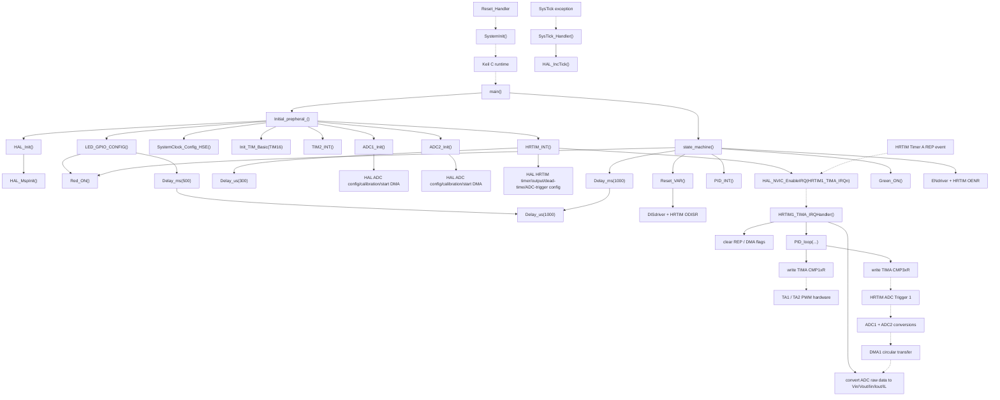
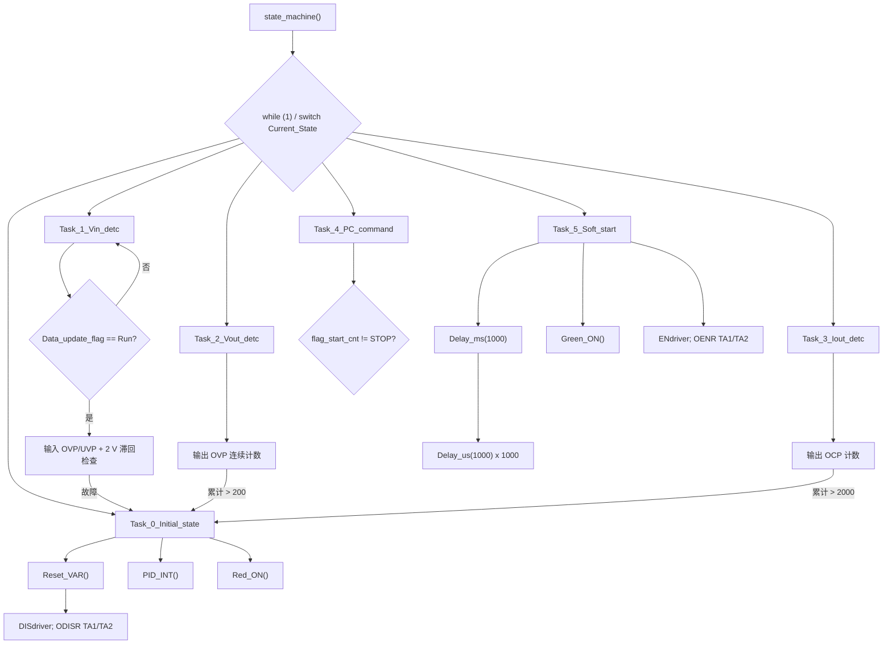
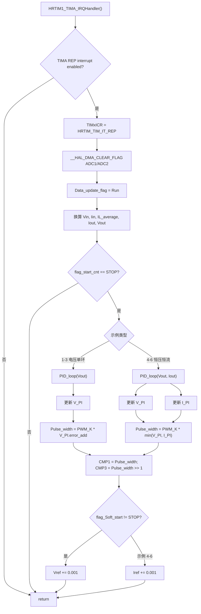

# STM32G474_BUCK Call Graph

本文档给出 6 个示例共享的应用级调用图。架构、状态机、时序和参数差异见 [UML.md](UML.md)；例程 1～3 的輸出電壓版本逐檔比較見 [EXAMPLES_1_3_VOLTAGE_VARIANT_COMPARISON.md](EXAMPLES_1_3_VOLTAGE_VARIANT_COMPARISON.md)。

## 1. 图例与边界

- `-->`：源码中的直接 C 调用或宏展开后的直接硬件操作。
- `-.->`：启动文件、NVIC、HRTIM、ADC 或 DMA 建立的隐式控制流/数据流。
- HAL 只保留对理解系统有影响的入口，不递归展开 STM32 HAL 内部函数。
- `SystemInit()`、C/C++ runtime 到 `main()` 的路径来自启动文件与 Keil 运行库约定；应用调用图从 `main()` 起是完全可见的。

## 2. 总调用图



`main()` 调用 `state_machine()` 后不再返回。后续执行由两个上下文组成：前台无限状态机，以及由 HRTIM REP 事件抢占前台的实时 ISR。

## 3. 上电初始化调用树

```text
main
├─ Initial_prepheral_
│  ├─ HAL_Init
│  │  └─ HAL_MspInit                         [HAL 回调]
│  ├─ SystemClock_Config_HSE
│  │  ├─ HAL_PWREx_ControlVoltageScaling
│  │  ├─ HAL_RCC_OscConfig
│  │  ├─ HAL_RCC_ClockConfig
│  │  ├─ HAL_RCCEx_PeriphCLKConfig
│  │  └─ SystemCoreClockUpdate
│  ├─ Init_TIM_Basic(TIM16)
│  │  └─ HAL_TIM_Base_Init
│  ├─ TIM2_INT
│  │  └─ HAL_TIM_Base_Init
│  ├─ LED_GPIO_CONFIG
│  │  ├─ HAL_GPIO_Init
│  │  ├─ Red_ON
│  │  │  └─ HAL_GPIO_WritePin
│  │  └─ Delay_ms(500)
│  │     └─ Delay_us(1000)                   [每毫秒一次]
│  ├─ ADC1_Init
│  │  ├─ HAL_GPIO_Init
│  │  ├─ HAL_ADC_Init
│  │  ├─ HAL_ADCEx_MultiModeConfigChannel
│  │  ├─ HAL_ADC_ConfigChannel               [3 个 rank]
│  │  ├─ HAL_ADCEx_Calibration_Start
│  │  ├─ HAL_DMA_Init / __HAL_LINKDMA
│  │  ├─ HAL_ADC_Start_DMA(ADC1_RESULT, 3)
│  │  └─ HAL_ADC_Start
│  ├─ ADC2_Init
│  │  ├─ HAL_GPIO_Init
│  │  ├─ HAL_ADC_Init
│  │  ├─ HAL_ADCEx_MultiModeConfigChannel
│  │  ├─ HAL_ADC_ConfigChannel               [2 个 rank]
│  │  ├─ HAL_ADCEx_Calibration_Start
│  │  ├─ HAL_DMA_Init / __HAL_LINKDMA
│  │  ├─ HAL_ADC_Start_DMA(ADC2_RESULT, 2)
│  │  └─ HAL_ADC_Start
│  └─ HRTIM_INT
│     ├─ HAL_HRTIM_Init
│     ├─ HAL_HRTIM_TimeBaseConfig             [Master, Timer A]
│     ├─ HAL_HRTIM_WaveformTimerConfig        [Master, Timer A]
│     ├─ HAL_HRTIM_WaveformTimerControl
│     ├─ HAL_HRTIM_WaveformOutputConfig       [TA1, TA2]
│     ├─ HAL_HRTIM_WaveformCompareConfig      [CMP1]
│     ├─ HAL_HRTIM_DeadTimeConfig
│     ├─ HAL_HRTIM_ADCTriggerConfig           [TIMA CMP3 -> Trigger 1]
│     ├─ HAL_HRTIM_SimpleBaseStart            [Master, Timer A]
│     ├─ Delay_us(300)
│     ├─ HAL_HRTIM_SimpleOCStart              [TA1, TA2]
│     ├─ HAL_HRTIM_SimplePWMStart             [TA1, TA2]
│     ├─ __HAL_HRTIM_TIMER_ENABLE_IT          [REP]
│     ├─ HAL_NVIC_SetPriority                 [0, 0]
│     └─ HAL_NVIC_EnableIRQ                   [HRTIM1_TIMA_IRQn]
└─ state_machine                              [不返回]
```

初始化顺序很重要：ADC 和 DMA 先准备好，HRTIM 后启动并提供 ADC 触发与 REP 中断，最后前台状态机关闭输出、复位控制变量并执行启动检查。

## 4. 前台调用图



`Task_4_PC_command` 当前没有调用通信接口；它只根据 `flag_start_cnt` 选择首次软启动或回到输入检查。因此名称保留了扩展意图，但现版本没有 PC 命令处理调用链。

## 5. HRTIM 中断与 PI 分支



PI 调用不是由 DMA 完成中断直接触发，而是由 HRTIM Timer A 的 REP 中断触发。ISR 读取 DMA 循环缓冲区当时的最新内容；这一区别对采样一致性和调试断点行为很重要。

## 6. 关键函数索引

| 函数/入口 | 所在文件 | 直接调用者或触发源 | 主要直接被调函数/动作 |
|---|---|---|---|
| `main` | `User_code/main.c` | C runtime | `Initial_prepheral_`, `state_machine` |
| `Initial_prepheral_` | `mycode/Int.c` | `main` | HAL、时钟、TIM16/TIM2、LED、ADC1/2、HRTIM 初始化 |
| `SystemClock_Config_HSE` | `mycode/clock_config.c` | `Initial_prepheral_` | RCC/PWR HAL，更新 `SystemCoreClock` |
| `ADC1_Init` / `ADC2_Init` | `mycode/ADC.c` | `Initial_prepheral_` | GPIO、ADC、DMA HAL |
| `HRTIM_INT` | `mycode/HRTIM.c` | `Initial_prepheral_` | HRTIM HAL、NVIC、`Delay_us` |
| `state_machine` | `mycode/state_machine.c` | `main` | `Reset_VAR`, `PID_INT`, LED、延时、驱动/输出寄存器 |
| `Reset_VAR` | `mycode/state_machine.c` | 状态机初始/故障路径 | 关闭驱动和 HRTIM 输出，清控制变量 |
| `HRTIM1_TIMA_IRQHandler` | `mycode/state_machine.c` | NVIC / Timer A REP | 数据换算、`PID_loop`、软启动参考递增 |
| `PID_INT` | `mycode/PID.c` | 状态机初始状态 | 初始化单环或双环 PI 状态与脉宽 |
| `PID_loop` | `mycode/PID.c` | HRTIM ISR | PI 计算，写 HRTIM `CMP1/CMP3` |
| `Delay_ms` / `Delay_us` | `mycode/Delay.c` | LED、HRTIM、软启动 | 轮询 TIM16 计数器 |
| `SysTick_Handler` | `User_code/stm32g4xx_it.c` | SysTick 异常 | `HAL_IncTick` |

## 7. 非函数调用边

以下关系不能由普通的“搜索函数名”完整发现，但属于真实执行链：

1. 启动向量表把 `HRTIM1_TIMA_IRQn` 映射到 `HRTIM1_TIMA_IRQHandler`。
2. `HRTIM_ADCTRIGGEREVENT13_TIMERA_CMP3` 把 Timer A CMP3 事件路由到 HRTIM ADC Trigger 1。
3. ADC1/ADC2 的外部触发源均为 `ADC_EXTERNALTRIG_HRTIM_TRG1`。
4. DMA1 Channel 1/2 分别将 ADC1/ADC2 结果循环写入 `ADC1_RESULT` 和 `ADC2_RESULT`。
5. `ENdriver`/`DISdriver` 是写 PA11 `BSRR/BRR` 的宏；`OENR/ODISR` 是第二层 HRTIM 输出门控。
6. HRTIM `CMP1` 决定 PWM 脉宽，`CMP3` 又决定后续 ADC 触发相位，形成“采样—控制—PWM—再采样”的闭环。

## 8. 未进入活动调用图的接口

源码头文件中还声明了 `LED_TEST`、`IWDG_Init_A`、`TIM3_INT`、`Set_duty`、`Voltage_Loop`、`MODS_01H`、`MODS_06H` 等接口，但当前应用路径没有对应调用（部分也没有实现），因此未画入活动调用图。`POWER_BOARD_RED_ON` 与 `POWER_BOARD_Green_ON` 有实现，但当前主路径未调用。
