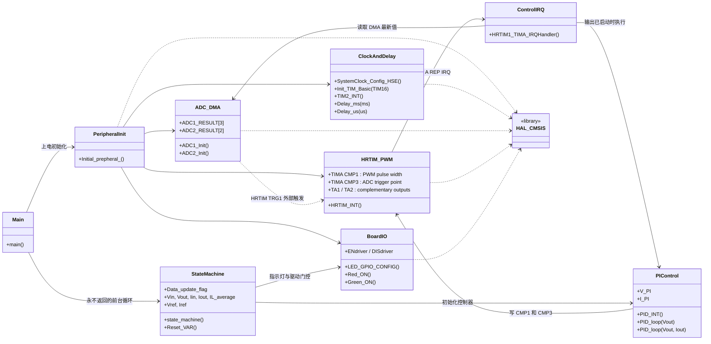
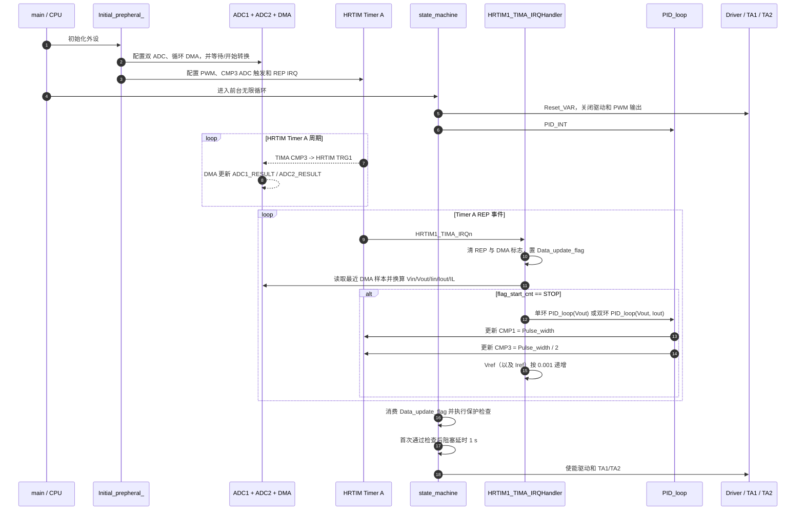
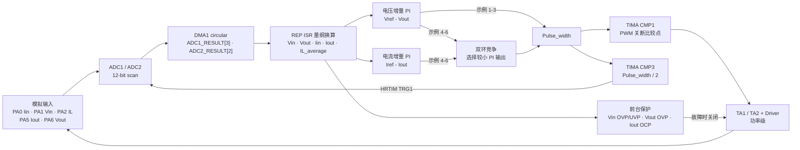

# STM32G474_BUCK UML 架构说明

本文档描述仓库中 6 个 STM32G474 电源示例的共同软件架构、状态机、实时控制链和主要差异。函数级关系见 [CALL_GRAPH.md](CALL_GRAPH.md)。

## 1. 分析范围

仓库中的每个 `例程*` 目录都是一套可独立构建的 Keil 工程，目录结构相同：

- `User_code/`：`main.c`、异常/中断模板、HAL MSP 与系统文件。
- `mycode/`：时钟、ADC、HRTIM、PI、状态机、延时和 RGB/驱动 GPIO。
- `HAL_lib/`：STM32G4 HAL/LL 库，本说明只展开应用直接使用的接口。
- `MDK/`：启动文件、CMSIS 和 Keil 工程文件。

示例 1～3 使用电压单闭环；示例 4～6 使用电压环与输出电流环竞争的恒压/恒流控制。除设定值、PI 参数、HRTIM 周期及少数保护细节外，六套工程的执行结构一致。

## 2. 示例差异矩阵

| 示例 | 控制模式 | 目标值 | `PWM_PERIOD` | 开关频率 | REP | 推算 REP 中断频率 | 输出 OVP | 电压 PI `Kp/Ki` |
|---|---|---:|---:|---:|---:|---:|---:|---:|
| 1 | 电压单环 | 5 V | 6800 | 800 kHz | 9 | 80 kHz | 10 V | 0.01 / 0.001 |
| 2 | 电压单环 | 12 V | 6800 | 800 kHz | 9 | 80 kHz | 15 V | 0.01 / 0.001 |
| 3 | 电压单环 | 16 V | 6800 | 800 kHz | 5 | 约 133.3 kHz | 19 V | 0.015 / 0.002 |
| 4 | 恒压/恒流 | 5 V / 3 A | 27200 | 200 kHz | 2 | 约 66.7 kHz | 10 V | 0.03 / 0.01 |
| 5 | 恒压/恒流 | 12 V / 3 A | 27200 | 200 kHz | 2 | 约 66.7 kHz | 16 V | 0.01 / 0.001 |
| 6 | 恒压/恒流 | 16 V / 3 A | 27200 | 200 kHz | 2 | 约 66.7 kHz | 20 V | 0.012 / 0.002 |

REP 中断频率按 `fPWM / (RepetitionCounter + 1)` 推算。所有示例的输入 OVP/UVP 分别为 24 V/8 V，输出 OCP 为 3.6 A；恒流示例的电流环使用与同一示例电压环相同的 `Kp/Ki`。

例程 1～3 的逐檔差異、占空比限制、軟啟動／保護時間尺度與原始碼位置，另見 [EXAMPLES_1_3_VOLTAGE_VARIANT_COMPARISON.md](EXAMPLES_1_3_VOLTAGE_VARIANT_COMPARISON.md)。

## 3. 模块视图



`common.h` 聚合了几乎全部应用头文件，因此源码层面的 include 依赖是环状的；上图表达运行时职责，而不是 include 拓扑。

## 4. 前台状态机

```mermaid
stateDiagram-v2
    [*] --> Initial

    state "Task_0_Initial_state" as Initial
    state "Task_1_Vin_detc" as VinCheck
    state "Task_2_Vout_detc" as VoutCheck
    state "Task_3_Iout_detc" as IoutCheck
    state "Task_4_PC_command" as Command
    state "Task_5_Soft_start" as SoftStart

    Initial : Reset_VAR()
    Initial : 关闭驱动与 TA1/TA2 输出
    Initial : PID_INT(); Red_ON()
    Initial --> VinCheck

    VinCheck --> VinCheck : Data_update_flag == STOP
    VinCheck --> Initial : 输入过压/欠压或滞回条件未恢复
    VinCheck --> VoutCheck : 有新数据且输入正常

    VoutCheck --> Initial : Vout > Vout_ovp 累计超过 200
    VoutCheck --> IoutCheck : 输出电压正常

    IoutCheck --> Initial : Iout > Iout_ocp 累计超过 2000
    IoutCheck --> Command : 输出电流正常/尚未达到计数阈值

    Command --> SoftStart : flag_start_cnt != STOP
    Command --> VinCheck : 已完成首次启动

    SoftStart : Delay_ms(1000)
    SoftStart : Green_ON(); ENdriver
    SoftStart : 使能 TA1/TA2; flag_start_cnt = STOP
    SoftStart --> VinCheck
```



故障路径没有独立的锁存状态，而是回到 `Task_0_Initial_state`。`Reset_VAR()` 立即关闭 PA11 驱动使能并通过 HRTIM `ODISR` 关闭 TA1/TA2，然后状态机重新检查输入条件。输入 OVP/UVP 标志不会被 `Reset_VAR()` 清除，因此分别使用 `Vin_ovp - 2 V` 和 `Vin_uvp + 2 V` 作为恢复滞回条件。

## 5. 上电与闭环时序



## 6. 控制数据流



单环示例把电压 PI 输出直接映射为脉宽。双环示例分别计算电压、电流 PI，取两者中较小值，因此任一环要求降低占空比时都能取得控制权。PI 使用增量形式：

```text
u[k] = u[k-1] + (Kp + Ki) * e[k] - Kp * e[k-1]
```

`PWM_K = PWM_PERIOD * 0.303030`，PI 内部输出以 3.3 V 量程为基准，再换算为 HRTIM 比较值。`CMP3 = Pulse_width >> 1` 使采样触发点随占空比移动到有效脉宽中点附近。

## 7. 并发与数据所有权

| 数据/资源 | 写入方 | 读取方 | 作用 |
|---|---|---|---|
| `ADC1_RESULT[]`, `ADC2_RESULT[]` | ADC DMA | REP ISR | 原始采样 |
| `Vin/Vout/Iin/Iout/IL_average` | REP ISR | 前台状态机，PI | 工程量与保护输入 |
| `Data_update_flag` | REP ISR 置 `Run` | 前台状态机清 `STOP` | 中断到前台的单槽通知 |
| `Vref/Iref` | REP ISR 软启动递增，`Reset_VAR()` 清零 | PI | 动态参考值 |
| `flag_start_cnt` | `Reset_VAR()`/软启动状态 | REP ISR | PI 执行门控 |
| HRTIM `CMP1/CMP3` | PI | HRTIM 硬件 | PWM 脉宽与采样相位 |
| PA11、HRTIM `OENR/ODISR` | 状态机 | 功率驱动/HRTIM | 双重输出门控 |

系统没有 RTOS。实时控制位于最高抢占优先级（0）的 HRTIM Timer A 中断，前台状态机只消费一个布尔更新标志，因此多个中断可以合并成一次前台检查；保护检查频率不应被视为严格等于 REP 中断频率。

## 8. 代码审阅注意事项

以下结论来自当前源码，适合作为后续硬件验证或重构清单：

1. `Data_update_flag`、测量值、参考值以及部分跨中断状态没有声明为 `volatile`。它们由 ISR 与前台共同访问，在较高优化等级下存在可见性风险。
2. `ADC2_RESULT` 在 `ADC.c` 中定义为 2 个元素，在 `state_machine.c` 中却声明为 3 个元素。当前只访问索引 0/1，但跨翻译单元类型应统一。
3. 示例 1～3 的 OCP 计数在电流恢复正常时不清零，因而统计的是累计越限次数；示例 4～6 带有 `else OCP_CNT1 = 0`，统计连续越限次数。
4. `Task_5_Soft_start` 使用 1 s 忙等待。中断仍执行采样，但前台保护在该 1 s 内暂停；此时 `flag_start_cnt` 尚未清除，所以 PI 不运行。
5. ADC 配置同时启用了 HRTIM 外部触发和 `ContinuousConvMode`。若设计目标是严格的“每个 CMP3 采一次”，需要在示波器/逻辑分析仪或参考手册上确认实际采样相位，必要时关闭连续转换。
6. `Target_IL` 和 `ILref` 在恒流示例中被初始化但未进入当前控制计算；真正的恒流反馈使用 `Iref` 与 `Iout`。
7. `HRTIM1_TIMA_IRQHandler()` 实现在 `state_machine.c` 而不是 `stm32g4xx_it.c`。链接层面可行，但会把实时 ISR、状态机和全局控制数据耦合在同一模块中。
8. `common.h` 与各模块头文件互相包含。头文件保护避免了递归展开，但模块边界不清晰，后续可改成按需 include 与显式 `extern` 接口。
9. HRTIM Timer A 配置为 `HRTIM_TIMFAULTENABLE_NONE`，当前 OVP/UVP/OCP 都是前台软件保护；`Config.h` 中提到的 COMP2/DAC 保护链未进入活动初始化与调用路径，不能视为逐周期硬件关断。
10. TIM2 被初始化但未在当前活动路径中读取；`ERROR_flag`、`PC_command` 以及若干头文件声明也尚未形成实际功能链，可在重构时确认保留意图。

## 9. 文档边界

图中的实线函数调用均可在当前应用源码中找到；虚线或硬件事件表示外设触发、DMA 写入和 NVIC 分发，不是普通 C 函数调用。HAL 内部调用、C 运行库启动细节及未使用的库函数没有展开。
